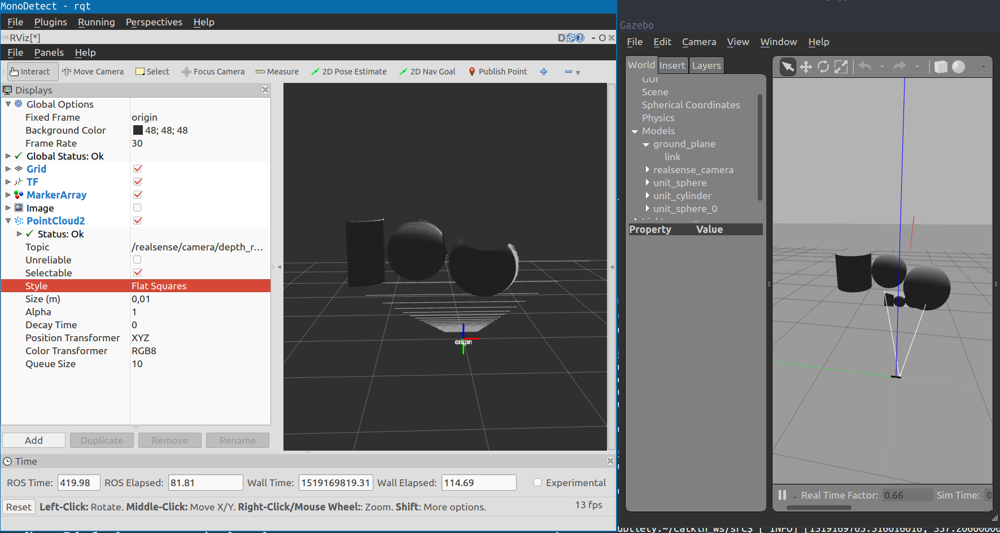

# Intel RealSense Gazebo ROS plugin and model

## Quickstart

Build the plugin
```bash
catkin build realsense_gazebo_plugin
```

Test it by running
```bash
roslaunch realsense_gazebo_plugin realsense.launch
```

## Run the unittests

After building the plugin, you can run the unittests
```bash
rostest realsense_gazebo_plugin realsense_streams.test
```

## Run the point cloud demo

Using [depth_image_proc](http://wiki.ros.org/depth_image_proc) package, we can generate a point cloud from the depth image by running
```bash
roslaunch realsense_gazebo_plugin realsense.launch # in terminal 1
roslaunch realsense_gazebo_plugin depth_proc.launch # in terminal 2
```

Then open Rviz, and display the `/realsense/camera/depth_registered/points` topic, you should see something like this


## Dependencies

This requires Gazebo 6 or higher and catkin tools for building.

The package has been tested on ROS indigo on Ubuntu 14.04 with Gazebo 7.

## Acknowledgement

This is continuation of work done by [guiccbr](https://github.com/guiccbr/) for Intel Corporation.
